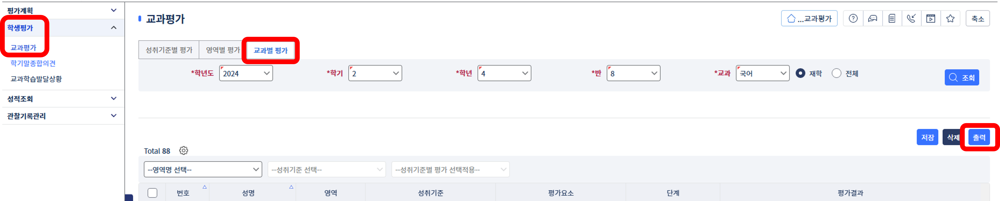
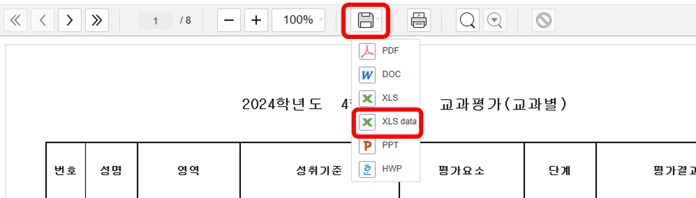

# 학기말 성적 생성기 사용 방법

  

1. 나이스에 접속한다.
2. 성적 - 학생평가 - 교과평가 메뉴로 들어간다.
3. 교과별 평가 탭을 누르고 들어가서 과목을 선택하고 조회한다.

---

 
 
 

  

4. 저장(💾) 버튼을을 누르고 XLS data 파일 형식을 선택한다.

---

 
 
 

  

5. 다운받은 엑셀 파일을 업로드하고 '생성하기' 버튼을 누르면 시작합니다.(10분 정도 걸릴 수 있으니 커피 한 잔 마시고 온다.)

- 서버에는 학생의 이름이나 번호 등 개인정보가 올라가지 않습니다.
- 엑셀 파일은 고치지 말고 그대로 업로드 해주세요.(직접 고치시면 작동하지 않을 수 있습니다.)
